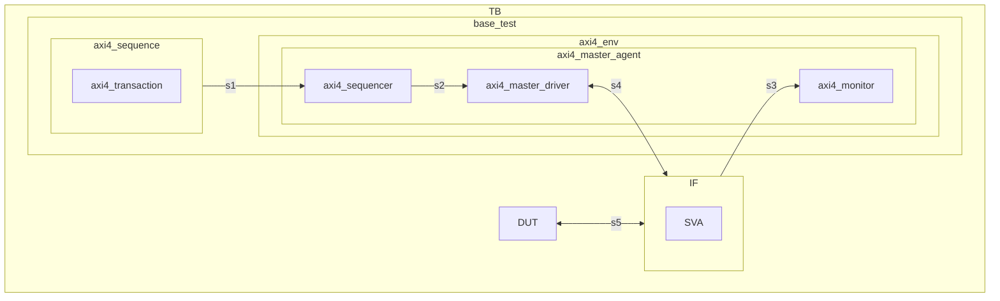

# AXI4\_MASTER\_VIP\_SPEC

# 1.AXI4协议官方文档                                  
./doc/IHI0022H\_amba\_axi\_protocol\_spec.pdf
./doc/102202_0100_01_Introduction_to_AMBA_AXI.pdf

# 2.feature list
1.数据传输支持3种突发(Burst)类型：
INCR类型，此突发类型支持1~256的突发长度(Burst Length)
FIXED类型，此突发类型支持1~16的突发长度；
WRAP类型，此突发类型仅支持2，4，8，16的突发长度。

2.支持发起端发出地址非对齐传输(Unaligned transfers)。

3.支持指定WSTRB掩码规则(Write Strobe Masking Rules)，WSTRB信号位宽为数据位宽(data\_width)/8。WSTRB掩码支持类似0b1011、0b1001非连续格式。

4.支持突发拆分(split)：当突发类型Burst配置为INCR且突发长度大于16时，支持把突发拆分成多个小突发，拆分后的突发长度最大支持32，且支持地址未跨越2K边界的突发传输的拆分。拆分后的突发每个突发使用不同的ID。

5.支持配置总线参数：可通过axi\_vip\_cfg实例配置以下参数：
数据位宽(data\_width)
地址位宽(addr\_width)
id位宽(id\_width)
最大的未处理地址数(max\_outstanding)
事务发送的间隔周期数。

6.2KB地址拆分：当一次突发传输的地址跨越2KB边界时，必须做拆分。

7.支持带宽利用率(band width efficiency)统计：
带宽利用率=实际有效数据传输速率/总线理论最大带宽。
有效数据传输速率=总有效数据量/总传输时间。
总线理论最大带宽=数据总线宽度\*总线工作时钟频率。
在传输结束时在log打印输出该端口的带宽利用率。

8.支持读写延迟（latency）统计，读写延迟的定义如下：
读延迟(尾拍延迟)：一笔突发事务内，从读地址被接受（ARVALID与ARREADY握手）到最后一个读数据被接受（RLAST拉高）的周期数差。
写数据接受延迟：从写地址被接受（AWVALID与AWREADY握手）到最后一个写数据被接受(WLAST拉高)的周期数差。
传输结束时在log打印输出：
master端口观察到的最大读/写延迟数据及对应的awid/arid。
平均读写延迟。

9.支持设置数据通道先于地址通道发送(support\_data\_before\_addr) 。支持配置发送写地址前最多可以发多少笔写数据 (data\_before\_addr\_osd)。

10.支持读写事务超时(timeout)阈值配置，当写事务传输等待断言BVALID的等待时长超过写事务超时阈值(wtimeout)时，上报具体时刻及对应awid，当读事务传输等待断言RLAST等待时长超过读事务超时阈值(rtimeout) 时，上报具体时刻及对应arid。

# 3.SV assertion定义
为了确保VIP驱动的时序符合AXI4标准协议，对VIP中需要实现的SV断言定义如下，需要在axi4\_if.sv中实现：
| 序号 | 断言名称 | 检查内容 |
| --- | --- | --- |
| 1 | AWVALID稳定断言 | Master发出的AWVALID一旦拉高，必须保持到AWREADY拉高 |
| 2 | ARVALID稳定断言 | Master发出的ARVALID一旦拉高，必须保持到ARREADY拉高 |
| 3 | WVALID稳定断言 | Master发出的WVALID一旦拉高，必须保持到WREADY拉高 |
| 4 | WLAST正确断言 | Master必须在burst的最后一个beat拉高WLAST，且仅在该beat拉高 |
| 5 | RLAST正确断言 | Master 必须在接收到的读数据 burst 的最后一个 beat（即第 ARLEN+1 个 beat）检测到 RLAST 拉高，除最后一个 beat 外，其他所有 beat 的 RLAST 必须为低电平 |
| 6 | AXLEN范围 | AWLEN/ARLEN 必须在 0-255 范围内；若为FIXED burst，则必须 ≤15（即最多16 beats），若AXBURST=0（FIXED），则必须 ≤15（即最多16 beats），若AXBURST=1（WRAP），，AXLEN 必须为 1、3、7 或 15（对应 2、4、8、16 beats），其他值非法 |
| 7 | AXBURST编码 | 必须为 0(FIXED)、1(INCR) 或 2(WRAP)，禁止为 3(保留值) |
| 8 | AXSIZE范围 | 2^AXSIZE 不能超过 DATA\_WIDTH/8（即单beat不能超总线带宽） |
| 9 | W通道数据稳定断言 | 从WVALID拉高到WREADY拉高期间，WDATA/WSTRB/WLAST必须保持稳定不变 |
| 10 | AR通道数据稳定断言 | 从ARVALID拉高到ARREADY拉高期间，ARADDR/ARID/ARLEN/ARSIZE/ARBURST等所有AR通道信号必须保持稳定不变 |
| 11 | WSTRB位宽匹配 | WSTRB 的位宽必须等于 DATA\_WIDTH/8 |
| 12 | 非对齐首beat | 若起始地址非对齐（addr % (2^AWSIZE) != 0），第一个 beat 的 WSTRB 必须仅置位从起始地址开始的有效字节位，低位字节对应位必须为 0 |

# 4.组件
AXI4\_VIP包含以下组件：
1.  axi4\_env：验证平台的顶层容器。负责：实例化并连接所有下级组件（Agent、Scoreboard、Coverage等）；提供跨组件的配置机制。
    
2.  axi4\_master\_agent：模拟AXI主设备的完整行为模块。它是一个容器，内部包含：axi4\_master\_driver（驱动器）、axi4\_sequencer（序列器）和axi4\_monitor（监视器）。可配置为主动模式（驱动总线）或被动模式（仅监控总线）。
    
3.  axi4\_master\_driver：位于axi4\_master\_agent内部。负责：从axi4\_sequencer获取事务（axi4\_transaction），将其转换为遵循AXI协议的信号时序，并驱动到物理接口上。
    
4.  axi4\_monitor：通常在主、从Agent内部各有一个。负责：被动监听总线信号，将信号活动还原为事务对象（axi4\_transaction），并发送给axi4\_scoreboard和axi4\_coverage组件。
    
5.  axi4\_sequencer：位于axi4\_master\_agent内部。是测试激励的调度中心。负责：执行用户编写的测试序列（Sequence）；将从Sequence生成的事务项，按顺序发送给axi4\_master\_driver。
    
6.  axi4\_transaction：验证平台中的核心数据对象。它是一个类，用于封装一次AXI总线事务的所有属性，例如：事务类型（读/写）；地址、数据、突发长度与类型；响应信号；ID、QoS、保护属性等。它在Sequence、Driver、Monitor、Scoreboard之间传递。
    
7.  axi4\_sequence：核心功能是作为测试激励的生成器，用于动态创建、配置和控制发送到AXI总线上的事务。
    

# 5.架构图

